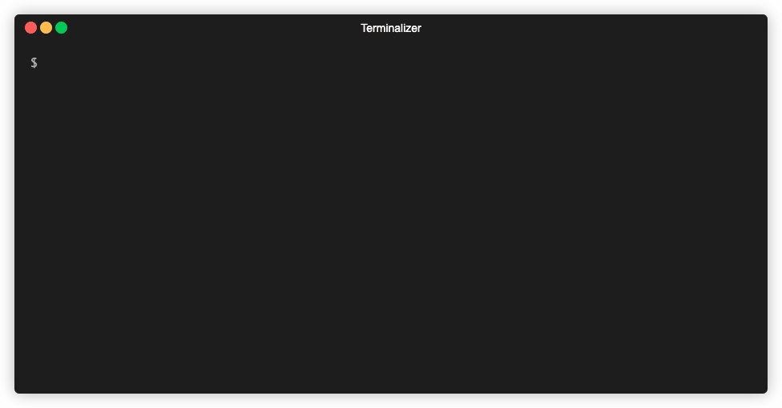

# mln
[](https://github.com/tkmru/mln/releases/latest)


`mln` a replacement for ln written in Golang. `mln` create a symbolic link, not a hard link. It is inspired by [exa](https://github.com/ogham/exa).



## Motivation

Every time I use the ln command, it puzzles me not knowing whether any of the arguments is source_file or target_file.
Also, maybe most people use the ln command to create only symbolic links, but creating a symbolic link requires the -s option. I wanted to make a symbolic link more easier, so I created `mln`.

## Installation

### Binary

Download the binary from [GitHub Releases](https://github.com/tkmru/mln/releases/) and drop it in your $PATH.

### Manually Build

You need Go 1.13 compiler.

```
$ go get github.com/tkmru/mln
```

## Usage

In mln, a symbolic link is created successfully regardless of which of the arguments specifies the link destination and link name.

```
$ mln -h
A modern version of ln. `mln` create a symbolic link, not a hardlink.

Usage:
  mln [target <file/dir>/symlink file] [symlink file/target <file/dir>] [flags]

Flags:
  -h, --help   help for mln
```

## License

MIT License
